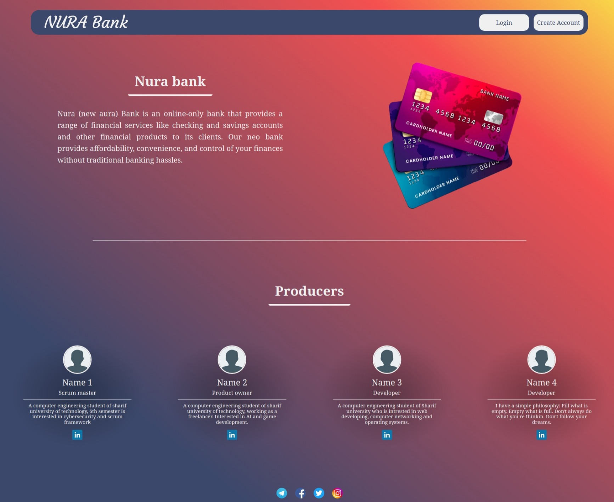

# Nura-Bank
Nura bank is a neo bank that offers digital banking services. Unlike traditional banks, Nura bank does not have physical branches or ATMs. Instead, customers can access their accounts, make payments, transfer money, and manage their finances through a web platform. 

# About this project
This project is a university assignment that demonstrates the concept of a Neo Bank and its website design. The website has several sections that provide useful functions for the clients. These sections are described below. Please note that this project is only a prototype and not a fully functional Neo Bank website. It is not responsive to different resolutions yet. The optimal resolution is FHD and lower or higher resolutions may cause display issues.
This project showcases my skills in HTML, SCSS and JS. I used these technologies to create an interactive web page that meets the design specifications.

# Landing Page
The landing page has a simple and minimal design. The top bar displays the brand name and the buttons for login and create account. The page introduces the bank and the developers briefly. The social media icons are at the bottom of the page.

